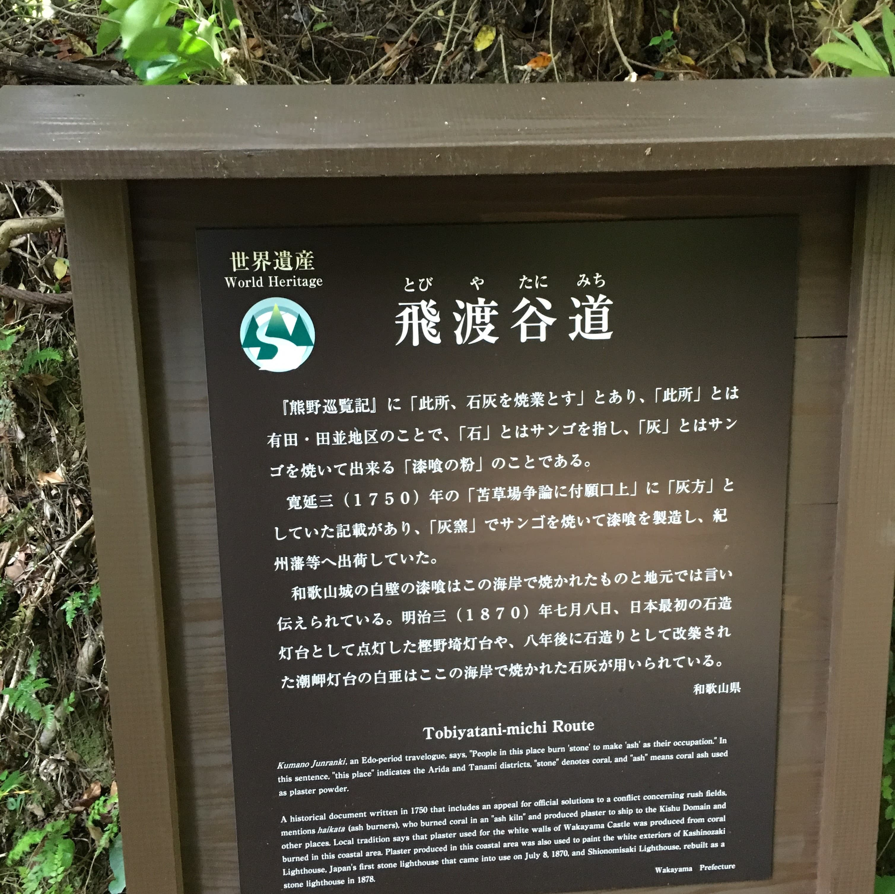
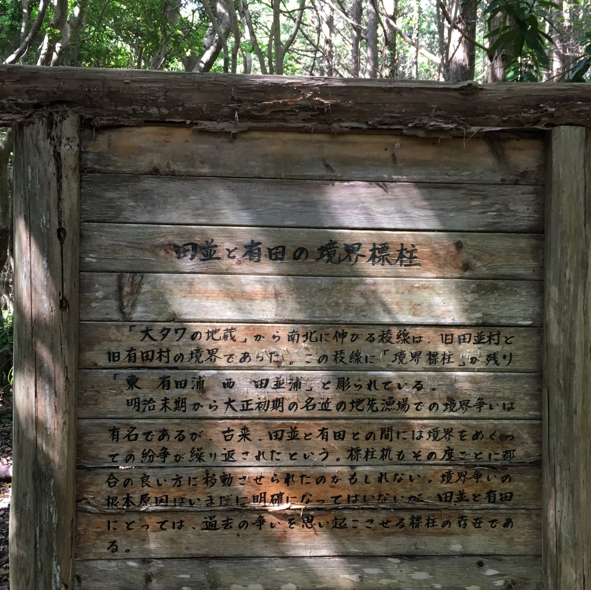
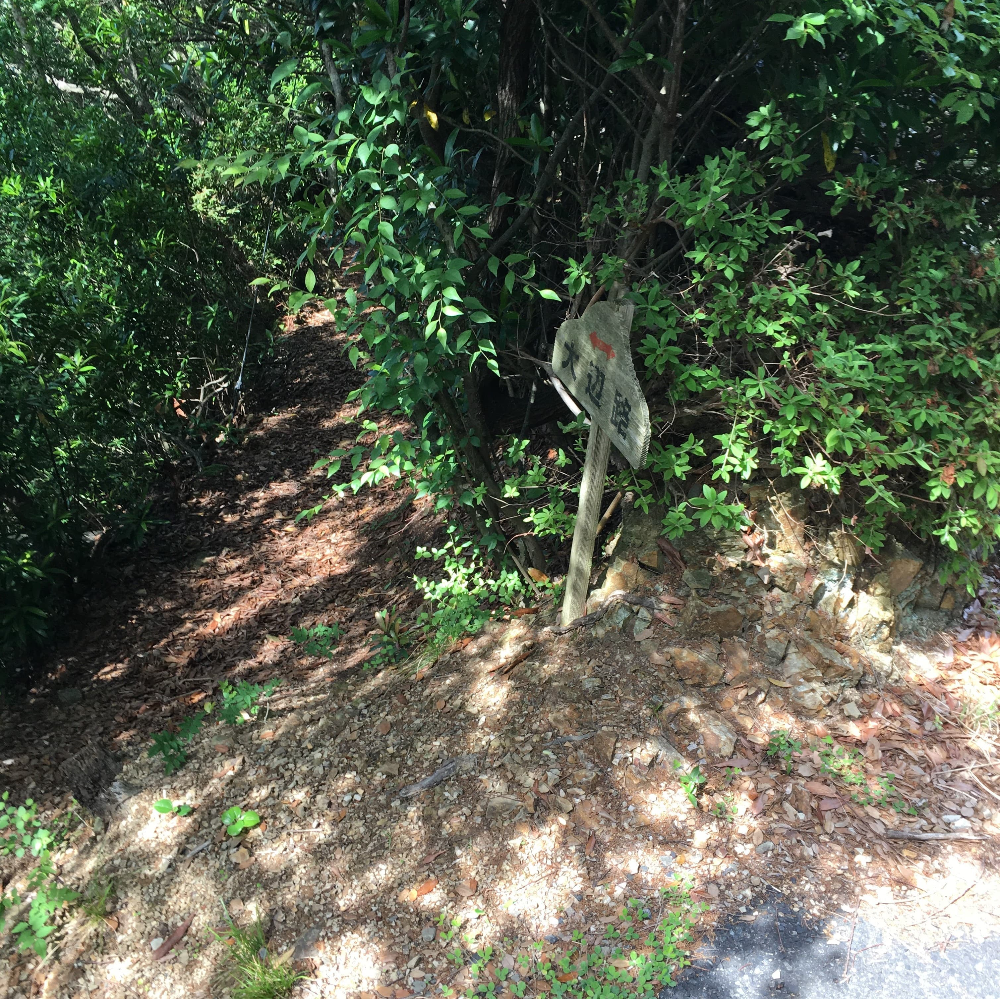

  <small>
  関西オープンフォーラム2017　2017/11/11(土) 
  OpenStreetMapで地域の情報を世界に向けて発信しよう!!!
  </small>

 

### マッピングパーティーから始めるOpenStreetMapの楽しみ方

 

 Yohei Taniguchi 

  <small>
    OpenStreetmap Japan 
    諸国・浪漫マッピングパーティー
  </small>

---

## マッピングパーティーを勧める3つの理由

---

### マッピングパーティーは・・・

1. 参加するのが簡単
1. 人に教えるのが簡単
1. 自分なりの楽しみ方を見つるのが簡単

--

#### 参加するのが簡単

1. イベントを探す
1. 「参加」をボタンを押す！

  

--

#### 人に教えるのが簡単

1. 特別な知識やスキルがいらいない。
1. 1回参加すればだいたいの流れが分かる。
1. 初心者もベテランもやってることの基本が同じなのでフォローしあいやすい。

--

#### 自分なりの楽しみ方を見つるのが簡単

- 地図・地形・地理が好き
  - 高低差が気になる人
  - 鉄道が好きな人
  - 城が好きな人
- 地域が好き
  - 町歩き・地域おこし・地域の再発見
  - 町の防災地図作り
  - 地域のアーカイブ活動

自分なりの得意領域や興味領域を持てる。

---

### マッピングパーティーって？

- みんなで現地調査し、その結果をOpenStreetMapに登録

---

#### 現地調査（サーベイ）

- [Field Paper](http://fieldpapers.org/)を印刷して何があったか記録する

  

--

#### 現地調査（サーベイ）

- 最初は、ポスト、案内板、地蔵、石碑など道路脇でポイントになるものを書く

  

---

### 2017年 和歌山で行われた マッピングパーティー

- オープンデータソンin和歌山市
- マッピングパーティ in 串本 「熊野古道大辺路をマッピングしよう！」

--

#### オープンデータソンin和歌山市

http://wida.jp/2017/03/23/odtinwakayama_report/

  

--

#### マッピングパーティ in 串本　 「熊野古道大辺路をマッピングしよう！」

https://wacker.doorkeeper.jp/events/60642

  

---

### マッピングパーティー開催の経緯

- 熊野古道のうち大辺路ルートの一部区間が世界遺産追加登録
- Web地図には大辺路ルートが登録されていない。

--

#### 設計・計画 

- ルート設計
  - マッピングパーティーで歩く候補ルートを調査（地図、自治体の広報誌）
  - 下見による確認　→　事前調査との相違点、マッピング対象候補、危険個所などの確認
  - 前日下見による確認　→　直前の道の状態を確認

--

#### 設計・計画 

- タイムテーブル設計
  - 事前説明、サーベイ、OpenStreetMap編集、昼食、現地への移動時間などスケジュール
  - バッファ時間や時間調整ポイントの設定

--

#### 設計・計画 

- タイムテーブル

  - 10:00～11:00 集合、オリエンテーション
  - 11:00～12:00 昼食
  - 12:00～14:30 熊野古道 飛渡谷道をサーベイ
  - 14:30～16:30 会場でOSM編集作業
  - 16:30～17:00 成果発表会、撤収

--

#### トラブル対応 

- 雨天・破天時対応
  - 代替ルートの想定
  - 中止判断基準や中止時連絡ルート

--

#### トラブル対応 

- 怪我・事故対応
  - イベント保険の加入
  - 周辺医院の場所、営業時間の確認

--

#### 事前手配

- 作業場所手配
  - 串本町の協力を得ることができ公民館を確保

- 機材手配
  - ネットワークの確認　→　Wifiをネットで手配
  - 下見の時にWifiの電波状況を確認
  - 30人でモバイルWifi2台はきつかった・・・

- 昼食手配
  - 周辺に飲食店がない場合やイベント時間の短縮で必要

--

#### 広報関連

- イベント告知
　- 関係者への協力要請やFB,イベント告知サイトでの案内

- 地元新聞社が取材対応
  - 紀伊民報 2017年5月25日  [世界遺産をＷｅｂで発信　串本で地図づくりイベント](http://www.agara.co.jp/news/daily/?i=334090&p=more)

  - 紀伊民報 2017年6月5日  [熊野古道の情報を地図入力　串本町でイベント](http://www.agara.co.jp/news/daily/?i=334621&p=more)

--

#### 関係者応対

- 地元関係者訪問
  - 地元観光協会の担当者を訪問
  - 当日移動に車を手配

--

### 当日準備

- 会場設営
- 機材チェック
- 受付設置
- 配布資料準備
- 昼食準備
- ゴミ箱準備

---

### 開催 

- 午前：説明
- 午後（前半）：サーベイ
- 午後（後半）：OpenStreetMap編集

---

### 準備から当日の様子 

---

#### 事前準備　下見 

  

--

#### 事前準備　下見 

  

--

#### 事前準備　下見 

  

--

#### 事前準備　下見 

--

#### 事前準備　下見 

--

#### 事前準備　下見 

--

#### 事前準備　下見 

--

#### 事前準備　下見 

--

#### 事前準備　下見 

--

#### 事前準備　下見 

--

#### 事前準備　下見 

--

#### 事前準備　下見 

--

#### 事前準備　下見 

--

#### 事前準備　下見 

--

#### 事前準備　下見 

---

#### 午前：オリエンテーション 

--

#### 午前：オリエンテーション 

---

#### 午後（前半）：サーベイ 

--

#### 午後（前半）：サーベイ 

--

#### 午後（前半）：サーベイ 

--

#### 午後（前半）：サーベイ 

--

#### 午後（前半）：サーベイ 

--

#### 午後（前半）：サーベイ 

---

#### 午後（後半）：OpenStreetMap編集 

---

#### 午後（後半）：OpenStreetMap編集 

http://www.openstreetmap.org/

--

#### 午後（後半）：OpenStreetMap編集 

--

#### 午後（後半）：OpenStreetMap編集 

--

#### 午後（後半）：OpenStreetMap編集 

--

#### 午後（後半）：OpenStreetMap編集 

--

#### 午後（後半）：OpenStreetMap編集 

---

### 打ち上げ!!!

- これ大事
- 次の日は有志で新宮でマッピングパーティー！！

---

#### 楽しむポイント

- マッピングしながら町を歩くと普段は気づかない景色が見えてくる。
- 地図に書き込んで情報が増えてくることが楽しくなってくる。
- 他にしたいことが出てくる。

--

#### 他にしたいこと？

- 自分の地域の地図を編集したい。
- 地図を使ったアプリを作ってみたい。
- 自分の地域でもマッピングパーティーをやってみたい。
- 他にマッピングパーティーをやりたいって人を手伝いたい。

---

## マッピングパーティーに参加しよう！

---

#### 近日開催

- 2017/11/12(日) 13:00 - 17:00  
淡路 昭和湯  
Re:furoマッピングパーティーvol.1
https://www.facebook.com/events/1341080032687318/

- 2017/12/09(土)  
諸国・浪漫マッピングパーティー 
幕末京都マッピングパーティ#00：志士たちの今
https://countries-romantic.connpass.com/event/71681/

- その他　イベント 
OpenStreetMap Japanサイト
https://openstreetmap.jp/eventlist

---

  <small>
  関西オープンフォーラム2017　2017/11/11(土) 
  OpenStreetMapで地域の情報を世界に向けて発信しよう!!!
  </small>

 

### マッピングパーティーから始めるOpenStreetMapの楽しみ方

 

 Yohei Taniguchi 

  <small>
    OpenStreetmap Japan 
    諸国・浪漫マッピングパーティー
  </small>

---
